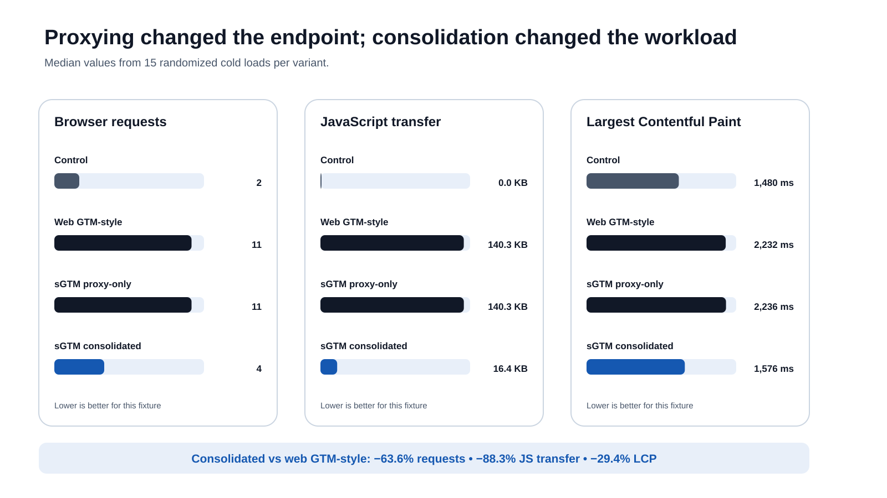
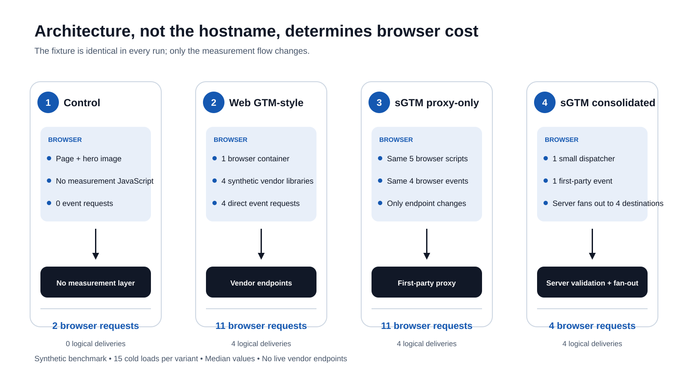

# Web GTM vs Server-Side GTM: Reproducible Benchmark

This repository contains the code, raw data, processed results, methodology, and verification tools for a controlled benchmark comparing a browser-heavy web GTM-style architecture with two server-side GTM patterns.

**Full analysis and interpretation:**  
[Server-Side GTM Benchmarked: What It Really Improves—and What It Does Not](https://metricfixer.com/publications/analytics-conversion-tracking/server-side-gtm-real-gains-marketing-myths-benchmark)

**Frozen release used by the article:**  
[v1.0.0 benchmark release](https://github.com/metricfixer/server-side-gtm-benchmark/releases/tag/v1.0.0)

> This is a synthetic architecture benchmark. It does not send data to live Google Analytics, Google Ads, Meta, affiliate, CRM, or other production vendor endpoints.

## Main finding

Changing only the collection endpoint did not remove browser work. The proxy-only variant loaded the same five JavaScript resources and sent the same four browser measurement requests as the web GTM-style variant. The measurable gain appeared only when four browser libraries and four browser requests were replaced by one small dispatcher and one first-party request, with destination fan-out moved behind the first hop.

## Median results

| Metric | Control | Web GTM-style | sGTM proxy-only | sGTM consolidated |
|---|---:|---:|---:|---:|
| Browser requests | 2 | 11 | 11 | 4 |
| Total transfer | 224.9 KB | 365.8 KB | 365.8 KB | 241.5 KB |
| JavaScript requests | 0 | 5 | 5 | 1 |
| JavaScript transfer | 0 KB | 140.3 KB | 140.3 KB | 16.4 KB |
| Largest Contentful Paint | 1,480 ms | 2,232 ms | 2,236 ms | 1,576 ms |
| Load event | 1,470.5 ms | 2,222.4 ms | 2,222.5 ms | 1,567.2 ms |
| Long tasks | 0 | 4 | 4 | 0 |
| Total Blocking Time | 0 ms | 253 ms | 265 ms | 0 ms |
| Browser event requests | 0 | 4 | 4 | 1 |
| Logical destination deliveries | 0 | 4 | 4 | 4 |

Compared with the web GTM-style variant, the consolidated flow reduced browser requests by **63.6%**, JavaScript transfer by **88.3%**, median LCP by **29.4%**, and median load time by **29.5%** in this fixture. These percentages describe this controlled test profile, not a guaranteed production uplift.



## Compared architectures

1. `control`: no measurement JavaScript.
2. `web_gtm`: one synthetic browser container, four synthetic vendor libraries, and four direct event requests.
3. `sgtm_proxy_only`: the same browser work, with only the collection endpoint changed.
4. `sgtm_consolidated`: one small browser dispatcher and one first-party request, followed by four logical server-side destination deliveries.



## Repository map

- `src/run_benchmark.py`: portable Playwright benchmark runner.
- `src/benchmark_core.py`: summary, CSV, percentile, and checksum helpers.
- `data/raw/`: all 60 individual runs used by the article.
- `data/processed/`: summary statistics and compact CSV output.
- `data/schema/`: JSON Schemas for the dataset and manifests.
- `data/manifest/`: provenance and package-validation metadata.
- `docs/`: methodology, environment, metric definitions, evidence boundaries, results, and limitations.
- `audits/`: the dated filter-list audit used for the AdBlock discussion.
- `scripts/`: verification, checksum, link-check, asset, metadata, and release tooling.
- `fixtures/`: the deterministic hero image used as the LCP resource.
- `snippets/`: CMS-ready links from the Metricfixer article to the repository and frozen release.

## Reproduce the benchmark

### Local Python environment

```bash
python -m venv .venv
. .venv/bin/activate
python -m pip install --upgrade pip
python -m pip install -r requirements.lock.txt
python -m playwright install chromium
python src/run_benchmark.py --output-dir artifacts/local-run
```

To use a system Chromium build explicitly:

```bash
python src/run_benchmark.py \
  --browser-executable /usr/bin/chromium \
  --output-dir artifacts/system-chromium-run
```

A one-run-per-variant smoke test is available through:

```bash
python src/run_benchmark.py \
  --runs-per-variant 1 \
  --browser-executable /usr/bin/chromium \
  --output-dir artifacts/smoke
```

### Docker

```bash
docker build -t metricfixer-sgtm-benchmark .
docker run --rm -v "$PWD/artifacts:/app/artifacts" metricfixer-sgtm-benchmark
```

### Validate the frozen dataset

```bash
python scripts/verify_results.py
python scripts/verify_checksums.py
python -m unittest discover -s tests -v
```

## Reproducibility note

The source bundle preserved the test profile and raw results but did **not** record the exact Python, Playwright, Chromium, operating-system, or machine versions used on 31 July 2026. This repository therefore separates:

- the immutable `v1.0.0` dataset used by the article;
- a pinned reproduction baseline for future reruns; and
- environment and run manifests generated by every new execution.

See [Environment](docs/ENVIRONMENT.md) and [Reproducibility](docs/REPRODUCIBILITY.md).

## Evidence boundaries

This repository directly reproduces the synthetic performance and delivery benchmark. The article also discusses Safari/WebKit behavior, consent, Google Analytics opt-out, blockers, attribution, and infrastructure cost. Those sections are based on browser/platform documentation, architecture analysis, and the dated filter-list audit; they were not all measured as live production experiments in `v1.0.0`. See the [Evidence matrix](docs/EVIDENCE_MATRIX.md).

## Release policy

The data used by the publication is tied to tag `v1.0.0`. New browser versions, new filter-list snapshots, or changed methodology must be published as a new release. Historical files must not be silently overwritten.

## License

- Code and scripts: [MIT](LICENSE).
- Benchmark data and repository-authored documentation: [CC BY 4.0](LICENSE-DATA.md).
- The Metricfixer article, name, logos, and other brand assets are not relicensed by this repository.

## Citation

Use GitHub's **Cite this repository** control or see [`CITATION.cff`](CITATION.cff). When discussing the interpretation rather than the dataset alone, cite the Metricfixer article linked above.

## Disclaimer

This is an independent Metricfixer research project. It is not affiliated with, sponsored by, or endorsed by Google. Google Tag Manager, Google Analytics, Google Ads, Chrome, Chromium, Safari, and related product names are trademarks of their respective owners. The benchmark uses synthetic deterministic payloads and should not be interpreted as a guaranteed performance, attribution, delivery, or conversion improvement for a production implementation.
